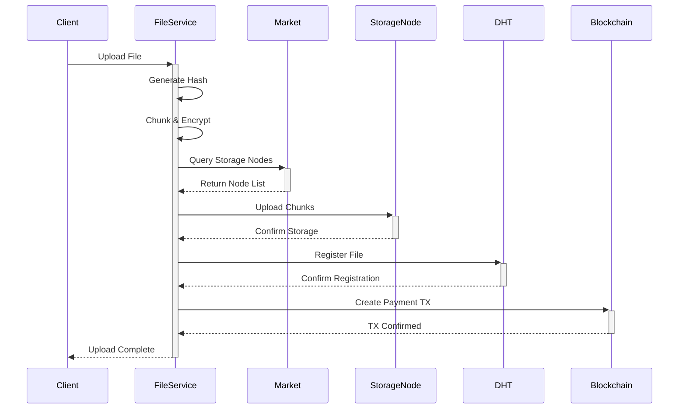
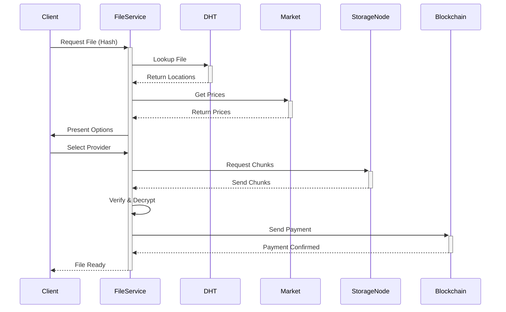

# Chiral Network Architecture

## System Architecture Overview

The Chiral Network implements a layered architecture that separates concerns and enables modular development. Each layer communicates through well-defined interfaces, allowing for independent scaling and updates.

## Core Architecture Components

### 1. Blockchain Infrastructure

#### Ethereum Network Implementation

```
Network Parameters:
- Network ID: 98765
- Chain ID: 98765 (0x181cd)
- Genesis Block: Custom with pre-funded addresses
- Block Time: ~15 seconds
- Initial Difficulty: 0x400000
- Difficulty Adjustment: Dynamic adjustment per block
- Mining Algorithm: Ethash (Proof of Work)
- Gas Limit: 4,700,000 (0x47b760)
- Extra Data: "Keep on keeping on!" (0x4b656570206f6e206b656570696e67206f6e21)
```

#### Modifications from Ethereum Mainnet

- **Bootstrap Nodes**: Custom seed nodes for network discovery
- **Genesis Configuration**: Pre-allocated funds for initial distribution
- **Network Isolation**: Separate network/chain ID (98765) to prevent mainnet connection
- **Chain Parameters**: Adjusted block time and difficulty for network requirements

#### Transaction Model

```
Ethereum Transaction Structure:
{
  nonce: 0,
  gasPrice: 20000000000, // 20 Gwei
  gasLimit: 21000,
  to: "0x742d35Cc6634C0532925a3b8D0C9e0c8b346b983",
  value: 1000000000000000000, // 1 ETH in wei
  data: "0x",
  v: 28,
  r: "0x...",
  s: "0x..."
}
```

### 2. Distributed Storage System

#### DHT Implementation

The system uses a Kademlia-based DHT for distributed file indexing:

```
DHT Structure:
- Node ID: 160-bit identifier
- Routing Table: K-buckets (k=20)
- Replication Factor: 3
- Lookup Complexity: O(log n)
```

#### File Storage Architecture

```
File Processing Pipeline:
1. File Input → SHA-256 Hash Generation
2. File Chunking → 256KB chunks
3. Chunk Encryption → AES-256
4. Chunk Distribution → Multiple storage nodes
5. DHT Registration → Hash-to-location mapping
```

#### Storage Node Structure

```
Storage Node:
{
  nodeId: "unique_peer_id",
  ip: "192.168.1.100",
  port: 8080,
  capacity: 1099511627776, // 1TB in bytes
  used: 549755813888, // 512GB in bytes
  pricePerGB: 0.001, // in native currency
  uptime: 0.99,
  reputation: 4.5
}
```

### 3. Market Mechanism

#### Centralized Market Server (Phase 1)

Initial implementation uses a centralized discovery server:

```
Market Database Schema:
Files Table:
- file_hash: VARCHAR(64) PRIMARY KEY
- file_size: BIGINT
- file_name: VARCHAR(255)
- upload_date: TIMESTAMP

Suppliers Table:
- supplier_id: VARCHAR(64)
- file_hash: VARCHAR(64)
- ip_address: VARCHAR(45)
- port: INTEGER
- price_per_mb: DECIMAL(10,8)
- bandwidth_limit: INTEGER
- last_seen: TIMESTAMP
- expires_at: TIMESTAMP
```

#### Market Operations

```
// Supplier Registration
POST /market/supply
{
  file_hash: "sha256_hash",
  ip: "192.168.1.100",
  port: 8080,
  price: 0.001,
  bandwidth: 100 // MB/s
}

// File Discovery
GET /market/lookup/{file_hash}
Response: [
  {
    supplier_id: "node_123",
    ip: "192.168.1.100",
    port: 8080,
    price: 0.001,
    reputation: 4.5
  }
]
```

#### Decentralized Market (Phase 2)

Future implementation using smart contracts:

```solidity
contract FileMarket {
  struct Listing {
    address supplier;
    bytes32 fileHash;
    uint256 price;
    uint256 deposit;
    uint256 expiry;
  }

  mapping(bytes32 => Listing[]) public listings;

  function listFile(bytes32 _hash, uint256 _price) external payable {
    // Implementation
  }

  function purchaseFile(bytes32 _hash, address _supplier) external payable {
    // Implementation
  }
}
```

### 4. Network Communication

#### P2P Protocol Stack

```
Protocol Layers:
┌─────────────────────┐
│   Application       │ ← File Transfer, Market Queries
├─────────────────────┤
│   libp2p            │ ← Peer Discovery, Routing
├─────────────────────┤
│   Transport         │ ← TCP/UDP, WebRTC
├─────────────────────┤
│   Network           │ ← IP, NAT Traversal
└─────────────────────┘
```

#### Message Types

```protobuf
// Protocol Buffer Definitions
message FileRequest {
  string file_hash = 1;
  uint64 offset = 2;
  uint64 length = 3;
}

message FileResponse {
  bytes data = 1;
  bool is_last_chunk = 2;
  string next_chunk_hash = 3;
}

message PriceQuery {
  string file_hash = 1;
  uint64 duration = 2; // storage duration in seconds
}

message PriceResponse {
  uint64 total_price = 1;
  uint64 price_per_mb = 2;
  uint64 price_per_day = 3;
}
```

### 5. Client Architecture

#### Desktop Application Stack

```
Frontend Layer:
- Framework: Svelte + TypeScript
- UI Library: Tailwind CSS
- State Management: Svelte Stores
- Desktop Runtime: Tauri (Rust)

Backend Services:
- File Manager: Handles chunking/assembly
- Wallet Service: Transaction management
- Network Service: P2P communication
- Storage Service: Local cache management
```

#### Client Operations Flow

```
File Upload:
1. Select File → Generate Hash
2. Create Chunks → Encrypt
3. Query Market → Find Storage Nodes
4. Negotiate Price → Create Transaction
5. Upload Chunks → Verify Storage
6. Register in DHT → Complete

File Download:
1. Input Hash → Query DHT
2. Discover Suppliers → Compare Prices
3. Select Supplier → Initiate Transfer
4. Download Chunks → Verify Hashes
5. Reassemble File → Decrypt
6. Make Payment → Complete
```

### 6. Security Architecture

#### Encryption Layers

```
File Encryption:
- Algorithm: AES-256-GCM
- Key Derivation: PBKDF2
- IV Generation: Cryptographically secure random

Network Encryption:
- Protocol: TLS 1.3
- Certificate: Self-signed for P2P
- Key Exchange: ECDHE

Transaction Security:
- Signature: ECDSA (secp256k1)
- Hash Function: SHA-256
- Address Format: Base58Check
```

#### Access Control

```
Permission Model:
- File Owner: Full control (read, write, delete, share)
- Storage Node: Read-only access to encrypted chunks
- Network Peer: No direct file access
- Market Server: Metadata only (no file content)
```

### 7. Data Flow Architecture

#### Upload Data Flow



#### Download Data Flow



### 8. Scalability Design

#### Horizontal Scaling

- **Storage**: Add more storage nodes
- **Market**: Multiple market servers with load balancing
- **Blockchain**: Increase block size or use sidechains
- **DHT**: Automatic scaling with node count

#### Vertical Scaling

- **Node Capacity**: Increase individual storage limits
- **Bandwidth**: Upgrade network connections
- **Processing**: More powerful hardware for mining

#### Optimization Strategies

```
Caching:
- L1: Memory cache (hot files)
- L2: SSD cache (frequently accessed)
- L3: HDD storage (cold storage)

Load Balancing:
- Geographic distribution
- Latency-based routing
- Bandwidth availability
- Price optimization
```

### 9. Fault Tolerance

#### Redundancy Mechanisms

```
File Redundancy:
- Replication Factor: 3 (minimum)
- Reed-Solomon Erasure Coding: 10+4
- Geographic Distribution: Different regions
- Automatic Repair: Self-healing on node failure
```

#### Failure Recovery

```
Node Failure:
1. Detection: Heartbeat timeout (30 seconds)
2. Mark Offline: Update DHT and market
3. Redirect: Route requests to replicas
4. Repair: Re-replicate to maintain redundancy
5. Cleanup: Remove after grace period

Network Partition:
1. Detection: Consensus split detection
2. Isolation: Prevent double-spending
3. Resolution: Longest chain rule
4. Merge: Reconcile when healed
```

### 10. Performance Optimization

#### Parallel Processing

```
Concurrent Operations:
- Multi-threaded chunking
- Parallel uploads to different nodes
- Concurrent chunk downloads
- Async transaction processing
```

#### Network Optimization

```
Techniques:
- Connection pooling
- Request batching
- Compression (gzip/brotli)
- CDN for popular files
- Predictive prefetching
```

## Implementation Priorities

### Phase 1: MVP

1. Basic blockchain with wallet
2. Simple file upload/download
3. Centralized market server
4. Desktop GUI

### Phase 2: Decentralization

1. Full DHT implementation
2. P2P market discovery
3. Enhanced encryption
4. Reputation system

### Phase 3: Optimization

1. Performance improvements
2. Mobile applications
3. Advanced features
4. Enterprise support

## Architecture Decisions Log

### Decision: Use Ethereum-Compatible Network

**Rationale**: Account-based model suits storage payments, extensive tooling, smart contract capability
**Alternative**: Build from scratch or use Bitcoin fork
**Trade-off**: More complex but more flexible for application needs

### Decision: Centralized Market Initially

**Rationale**: Faster development, easier debugging
**Alternative**: Fully decentralized from start
**Trade-off**: Temporary centralization for faster iteration

### Decision: 256KB Chunk Size

**Rationale**: Balance between overhead and parallelism
**Alternative**: Variable chunk sizes
**Trade-off**: Simplicity over optimization

### Decision: Ethash Mining Algorithm

**Rationale**: ASIC-resistant, proven by Ethereum, fair distribution
**Alternative**: SHA-256, Scrypt, RandomX
**Trade-off**: Memory-hard algorithm prevents centralization
