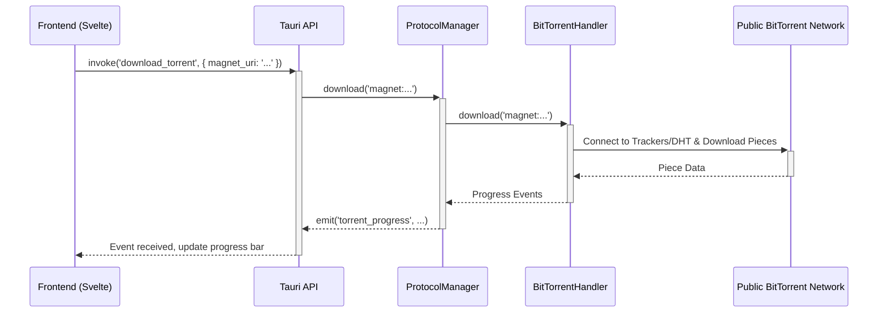
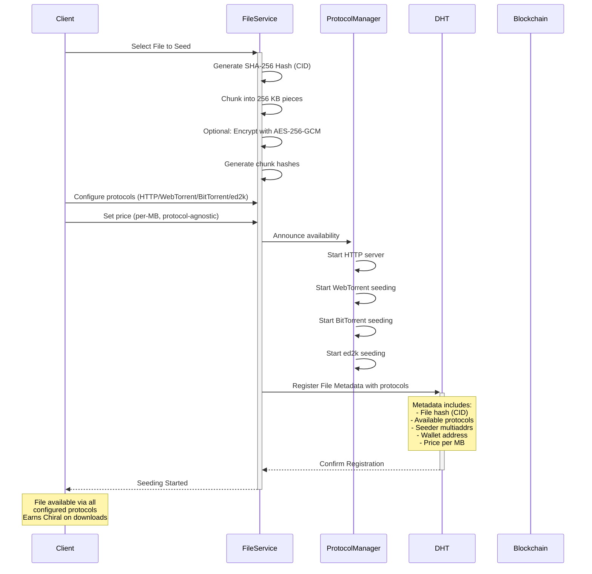
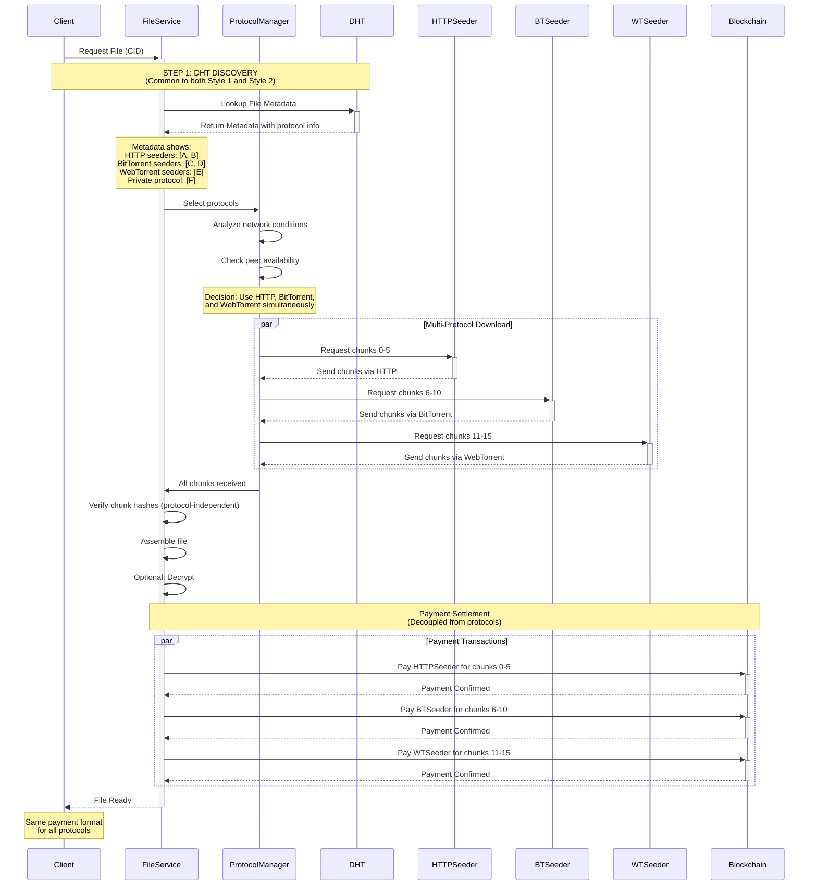

# Chiral Network Architecture

## System Architecture Overview

The Chiral Network implements a **decoupled layered architecture** where the payment mechanism is completely separate from data transfer protocols. This separation enables protocol flexibility while maintaining consistent economic incentives across all transfer methods (HTTP, WebTorrent, BitTorrent, ed2k).

Each layer communicates through well-defined interfaces, allowing for independent scaling and updates.

## Decoupled Architecture Design

### Payment Layer vs Data Transfer Layer

**Key Architectural Principle**: Payments are completely decoupled from data transfer protocols.

```
┌─────────────────────────────────────────────────────────┐
│                    Application Layer                      │
│             (File Management, User Interface)             │
└─────────────────────────────────────────────────────────┘
                              │
        ┌─────────────────────┴─────────────────────┐
        │                                           │
┌───────▼──────────────┐              ┌────────────▼────────┐
│  Payment Layer       │              │ Data Transfer Layer │
│  (Blockchain)        │              │  (Protocols)        │
│                      │              │                     │
│  • ETH-compatible    │◄─────────────┤  • HTTP             │
│  • Payment contracts │  Settlement  │  • WebTorrent       │
│  • Mining rewards    │              │  • BitTorrent       │
│  • Gas fees          │              │  • ed2k             │
└──────────────────────┘              └─────────────────────┘
```

### Why Decoupling Matters

1. **Protocol Flexibility**: Add new protocols (e.g., IPFS, custom protocols) without changing payment logic
2. **Independent Evolution**: Upgrade payment mechanisms without touching data transfer code
3. **Legacy Protocol Support**: Use established protocols (BitTorrent, ed2k) without modification
4. **Choice**: Users select best protocol for their network while payments remain consistent
5. **Testing**: Test data transfer and payments independently

---

### Protocol Abstraction and Management

**`ProtocolManager`** and **`IContentProtocol`** unify all content exchange operations under a consistent API, abstracting away the protocol-specific details. This ensures a consistent **UX** and provides a contract for developing new protocols. This should evolve as new features are needed.

---

#### `IContentProtocol` Interface

Defines mandatory capabilities for any content protocol. Implementations like **Bitswap** must provide these methods:

```typescript
export interface IContentProtocol {
  /** Get the protocol name */
  getName(): Protocol;

  /** Get peers serving the content */
  getPeersServing(identification: FileIdentification): Promise<PeerInfo[]>;

  /** Retrieve metadata for a file/content */
  getFileMetadata(identification: FileIdentification): Promise<FileMetadata | null>;

  /** Download content from a peer */
  getContentFrom(
    peerId: string,
    identification: FileIdentification,
    progressUpdate: ProgressUpdate,
    outputPath?: string
  ): Promise<Uint8Array | Void>;

  /** Start seeding/sharing content */
  startSeeding(
    filePathOrData: string | Uint8Array,
    progressUpdate: ProgressUpdate
  ): Promise<FileMetadata>;

  /** Stop seeding/sharing content */
  stopSeeding(identification: FileIdentification): Promise<boolean>;

  /** Pause an ongoing download */
  pauseDownload(identification: FileIdentification): Promise<boolean>;

  /** Resume a paused download */
  resumeDownload(identification: FileIdentification): Promise<boolean>;

  /** Cancel an ongoing download */
  cancelDownload(identification: FileIdentification): Promise<boolean>;
}
```

---

#### `ProtocolManager` Class

The **`ProtocolManager`** is the gateway for all protocol interactions. It manages multiple protocol implementations and delegates operations to the active protocol.

##### Key Methods

| Method                                   | Description                                                                              |
| :--------------------------------------- | :--------------------------------------------------------------------------------------- |
| `constructor(initialProtocol: Protocol)` | Registers available protocols (e.g., `BitSwapProtocol`) and sets the active protocol.    |
| `setProtocol(protocol: Protocol)`        | Switches the currently active protocol.                                                  |
| `getProtocolImpl(): IContentProtocol`    | Returns the active protocol implementation.                                              |
| `getPeersServing(..)`                    | Delegates to the active protocol to list available peers.                                |
| `downloadFile(..)`                       | Convenience method: fetches peers if needed and downloads from the preferred/first peer. |
| `uploadFile(..)`                         | Convenience method: seeds content via the active protocol.                               |
| `stopSharing(..)`                        | Stops seeding/sharing content.                                                           |
| `pauseDownload(..)`                      | Pauses an ongoing download.                                                              |
| `resumeDownload(..)`                     | Resumes a paused download.                                                               |
| `cancelDownload(..)`                     | Cancels an ongoing download.                                                             |
| `cleanup(): Promise<void>`               | Calls cleanup for all registered protocols for proper shutdown.                          |

```typescript
export class ProtocolManager {
  private currentProtocol: IContentProtocol;
  private protocols: Map<Protocol, IContentProtocol>;

  constructor(initialProtocol: Protocol = Protocol.Bitswap) {
    this.protocols = new Map();
    this.protocols.set(Protocol.Bitswap, new BitSwapProtocol());

    const protocol = this.protocols.get(initialProtocol);
    if (!protocol) {
      throw new Error(`Protocol ${initialProtocol} not found`);
    }
    this.currentProtocol = protocol;
  }

  setProtocol(protocol: Protocol): void {
    this.currentProtocol = protocol
  }

  getProtocol(): Protocol {
    return this.currentProtocol.getName();
  }

  getProtocolImpl(): IContentProtocol {
    return this.currentProtocol;
  }

  // Convenience methods delegating to current protocol (getPeersServing, downloadFile, uploadFile, etc.)
  // ...
}
```

#### Example Usage in BitSwap

* `get_peers_serving(identification: filemetadata)`

  * Invokes a Tauri command that calls `kademlia.get_providers(identification.merkel_root)`.
  * Returns a list of peers currently serving the content.

* `get_file_metadata(identification: string (merkel_root))`

  * Queries the DHT for metadata associated with the content.
  * In Bitswap, this involves retrieving the FileMetadata structure using `kademlia.get`.

* `get_content_from(peerId, identification, progress_update)`

  * Invokes `bitswap.get_from(identification, peerId)` in the swarm event loop.
  * Calls `progress_update(receivedChunks / totalChunks)` as chunks are received.
  * Returns void, `progress_update(1)` invoked when download completes.

* `start_seeding(identification, file_path | data, progress_update)`
  * File path as input
  * Generates `FileMetadata` and inserts it into the DHT.
  * Chunks the file and stores blocks in the on-disk blockstore.
  * Calls `progress_update` as each chunk is stored.
  * Returns FileMetaData

* `stop_seeding(identification)`

  * Removes the file metadata from the DHT.
  * Deletes associated chunks from the on-disk blockstore.
  * **Note:** If multiple files share the same CID, a reference count mechanism should decrement instead of deleting the blocks.

* `pause_download_for(identification)` / `resume_download_for(identification)` / `cancel_download_for(identification)`

  * Standard operations to control ongoing downloads.
  * Returns true if success

* `set_protocol(protocol)`

  * Switches the active protocol for all subsequent operations.


### How It Works

The network supports **two protocol styles** for file transfer and payment.

**⚠️ IMPORTANT**: **Both styles ALWAYS start with DHT discovery** as the first step. DHT discovery is the common mechanism for:

- Finding which nodes are seeding a file
- Discovering what protocols each node supports (HTTP, BitTorrent, WebTorrent, ed2k, or private protocol)
- Getting connection endpoints and wallet addresses
- After DHT discovery, clients select appropriate protocol(s) based on availability and preference

#### Common First Step: DHT-Based Peer Discovery

**All downloads begin with DHT query** regardless of protocol style:

```
1. DHT Discovery (Common to Both Styles):
   - Client queries DHT with file hash (CID)
   - DHT returns list of peers seeding the file
   - Each peer advertises:
     * Available protocols (HTTP, BitTorrent, WebTorrent, ed2k, or private protocol)
     * Wallet address for payment
     * Available chunks
     * Price per MB
   - Client selects peers based on protocol availability and preference

Example DHT Response [TODO revise this]:
{
  file_hash: "sha256_abc123...",
  seeders: [
    {
      peer_id: "12D3KooW...",
      protocols: ["http", "bittorrent"],  // Style 1 protocols
      http_url: "http://192.168.1.100:8080/",
      wallet: "0x742d35Cc...",
      chunks: [0, 1, 2, ..., 15]
    },
    {
      peer_id: "12D3KooX...",
      protocols: ["webtorrent"],  // Style 1 protocol
      webrtc_signaling: "ws://signaling.server/",
      wallet: "0x8A3b2C1d...",
      chunks: [0, 1, 2, ..., 15]
    },
    {
      peer_id: "12D3KooY...",
      protocols: ["chiral-private"],  // Style 2 protocol
      private_endpoint: "/ip4/10.0.0.5/tcp/4001/p2p/12D3KooY...",
      wallet: "0x1B2c3D4e...",
      chunks: [0, 1, 2, ..., 15]
    }
  ]
}
```

After DHT discovery, client proceeds with selected protocol style.

#### Style 1: Public Protocols with Out-of-Band Payments (Default)

Uses established public protocols for data transfer, with payments settled separately on blockchain.

**Supported Public Protocols**:

- **HTTP/HTTPS**: Standard web protocol
- **BitTorrent**: DHT-based P2P swarming
- **WebTorrent**: Browser-compatible WebRTC
- **ed2k**: eDonkey2000 multi-source

**Public Protocol Interaction Flow:**

When a downloader initiates a file transfer using a public protocol like HTTP or BitTorrent, the following sequence of events occurs:

1.  **Peer Discovery and Protocol Selection:** The downloader queries the Chiral DHT to find peers seeding the content. The DHT returns a list of seeders, each advertising the protocol(s) they support (e.g., HTTP, BitTorrent).
    *   **Seeder-Side:** Seeders advertise a default protocol based on their network capability (HTTP for public IPs, WebTorrent for those behind a NAT).
    *   **Downloader-Side:** The downloader analyzes the list of available seeders and protocols, and selects the optimal protocol(s) based on factors like user preference, network conditions, and file characteristics. The client can decide to use multiple protocols simultaneously from different peers to maximize speed.
2.  **Peer Handshake and Price Negotiation:** The downloader and seeder(s) establish a connection. A handshake process is performed, during which they agree upon the terms of the transfer, including pricing. This negotiation is facilitated through DHT messages (the exact mechanism is to be defined).
3.  **Initiation of Download:** Once terms are agreed upon, the downloader can commence the download from the seeder using one or both of the following methods (the default is to be determined):
    *   **Public Protocol:** The transfer occurs directly over the specified public protocol (e.g., HTTP, BitTorrent).
    *   **Private Protocol:** The transfer is wrapped within the Chiral private protocol.
4.  **Parallel Downloading from Public Sources:** Concurrently with the above steps, the downloader can also fetch parts of the file from its original public source (e.g., the public BitTorrent network), enabling multi-source downloads.

**Default Protocol Selection by Network Capability**:

```
Node has public IP address:
  └─> Serve via HTTP (default)
      - Most compatible
      - Works with all clients
      - No NAT traversal needed

Node behind NAT (no public IP):
  └─> Serve via WebTorrent (default)
      - WebRTC NAT traversal via STUN/TURN
      - Browser compatible
      - P2P connection through NAT

  OR (needs discussion with students)

  └─> Serve via BitTorrent (alternative)
      - More efficient for large files
      - Better swarming
      - Requires BitTorrent DHT
```

**Complete Flow for Style 1 (Out-of-Band Payment)**:

```
1. DHT Discovery Phase (COMMON STEP):
   - Query DHT for file hash → Get seeder list with protocols
   - DHT returns peers advertising HTTP, BitTorrent, WebTorrent, or ed2k
   - [Work Needed] specification on metadata format

2. Protocol Selection (Data Layer):
   - Client selects protocol based on:
     * Seeder's advertised protocols (HTTP/BitTorrent/WebTorrent/ed2k)
     * Network conditions (NAT status, bandwidth)
     * Client capabilities (browser vs desktop)
     * Performance metrics
   - Example: Select Peer A (HTTP) and Peer B (BitTorrent)

3. Data Transfer (Public Protocol):
   - HTTP: Direct HTTP GET requests to Peer A
   - BitTorrent: BitTorrent protocol swarming with Peer B
   - WebTorrent: WebRTC data channels (if selected)
   - ed2k: eDonkey2000 multi-source (if selected)

4. Verification (Independent):
   - Verify chunk hashes against manifest
   - Independent of protocol used
   - Ensure all chunks received correctly

5. Payment Settlement (Blockchain - OUT-OF-BAND):
   - AFTER successful transfer verification
   - Send separate payment transaction on blockchain to each seeder
   - Payment decoupled from data transfer
   - Same payment logic regardless of protocol
   - Example: Pay Peer A (HTTP) + Pay Peer B (BitTorrent)
```

[Revise, there are some steps unclear: Negotiate for price, payment frequence, etc]

**Advantages**:

- Uses proven, mature protocols
- No modification to existing protocol specs
- Works with standard clients (for BitTorrent, ed2k)
- Protocol selection flexibility

**Limitations**:

- Requires separate payment step
- Payment trust model (download first, pay later or pay first, download later)
- Two-phase process (data + payment)

#### Style 2: Private Protocol with In-Band Payments (Under Discussion)

Proprietary protocol that combines data transfer and payment in a single channel.

**Two Options Under Consideration**:

**Option A: BitSwap-Like Protocol**

```
Characteristics:
- Block exchange with atomic payment
- Request/response model
- Payment verification per chunk
- Similar to IPFS BitSwap but with payment

Complete Flow:
1. DHT Discovery Phase (COMMON STEP):
   - Query DHT for file hash → Get seeder list
   - DHT returns peers advertising "chiral-private" protocol
   - Get private endpoint addresses

2. Connect to Private Protocol Peer:
   - Establish connection to peer's private endpoint
   - Protocol handshake

3. Atomic Chunk Exchange (Repeat for each chunk):
   - Request chunk + provide payment proof
   - Seeder verifies payment on blockchain
   - Seeder sends chunk if payment valid
   - Client verifies chunk hash
   - Repeat for all chunks

4. Complete Transfer:
   - All chunks received and verified
   - Payments already settled during transfer (in-band)

Advantages:
- Atomic exchange (pay-per-chunk)
- No trust required
- Fairness guaranteed
- Starts with same DHT discovery as Style 1

Challenges:
- Payment latency (blockchain confirmation)
- Higher overhead (payment per chunk)
- Complexity
```

**Option B: WebRPC-Based Private Protocol**

```
Characteristics:
- RPC-style protocol
- Session-based transfers
- Batch payment for multiple chunks
- Custom protocol design

Complete Flow:
1. DHT Discovery Phase (COMMON STEP):
   - Query DHT for file hash → Get seeder list
   - DHT returns peers advertising "chiral-private" protocol
   - Get private endpoint addresses

2. Session-Based Transfer:
   - Establish session with payment channel
   - Stream chunks with payment proofs (IN-BAND)
   - Batch payment settlement during session
   - Close session

3. Complete Transfer:
   - All chunks received and verified
   - Payments settled during session (in-band)

Advantages:
- Lower payment overhead
- Better performance
- Flexible design
- Starts with same DHT discovery as Style 1

Challenges:
- Custom protocol complexity
- Requires both peers to support
- More implementation work
```

**[Decision Needed - Discussion with Students]**:

- Which private protocol to implement?
- BitSwap-like (proven concept, atomic) vs WebRPC (custom, flexible)
- Or implement both and let clients choose?
- Priority vs public protocols? (Now, I am leanning to support public protocols first)

**In-Band Payment Benefits**:

- Single protocol for data + payment
- Atomic exchange guarantees
- No separate payment step
- Trustless operation

**Current Status**:

- **Style 1 (Public + Out-of-Band)**: Primary implementation target
- **Style 2 (Private + In-Band)**: Design phase, needs decision on approach

## Core Architecture Components

### Hash Format Conventions

**Important**: The network uses different hash formats for different types of identifiers:

- **File Hashes (Content IDs)**: Plain 64-character hexadecimal strings **without** the `0x` prefix
  - Example: `7d8f9e8c7b6a5d4f3e2d1c0b9a8d7f6e5d4c3b2a17d8f9e8c7b6a5d4f3e2d1c0`
  - Used for: File identification, Merkle roots, chunk hashes
  - Algorithm: SHA-256

- **Blockchain Addresses & Hashes**: Hexadecimal strings **with** the `0x` prefix
  - Example: `0x742d35Cc6634C0532925a3b8D0C9e0c8b346b983`
  - Used for: Wallet addresses, transaction hashes, block hashes
  - Format: Ethereum-compatible

This distinction helps differentiate between file system operations (content addressing) and blockchain operations (payments, mining).

### 1. Blockchain Infrastructure (Payment Layer)

**Purpose**: Handle all payment transactions for file transfers, independent of which protocol is used for data transfer.

#### Ethereum Network Implementation

```
Network Parameters:
- Network ID: 98765
- Chain ID: 98765 (0x181cd)
- Genesis Block: Custom with pre-funded addresses
- Block Time: ~15 seconds
- Initial Difficulty: 0x400000
- Difficulty Adjustment: Dynamic adjustment per block
- Mining Algorithm: Ethash (Proof of Work)
- Gas Limit: 4,700,000 (0x47b760)
- Extra Data: "Keep on keeping on!" (0x4b656570206f6e206b656570696e67206f6e21)
```

#### Modifications from Ethereum Mainnet

- **Bootstrap Nodes**: Custom seed nodes for network discovery
- **Genesis Configuration**: Pre-allocated funds for initial distribution
- **Network Isolation**: Separate network/chain ID (98765) to prevent mainnet connection
- **Chain Parameters**: Adjusted block time and difficulty for network requirements

#### Payment Transaction Model

**Protocol-Agnostic Payment Structure**: Same transaction format regardless of HTTP, WebTorrent, BitTorrent, or ed2k.

```
Payment Transaction Structure:
{
  nonce: 0,
  gasPrice: 20000000000, // 20 Gwei
  gasLimit: 21000,
  to: "0x742d35Cc6634C0532925a3b8D0C9e0c8b346b983", // Seeder's address
  value: 1000000000000000000, // Payment in wei
  data: "0x...", // Optional: file_hash, chunk_ids, protocol_used metadata
  v: 28,
  r: "0x...",
  s: "0x..."
}
```

**Key Feature**: This payment structure is identical whether the file was transferred via HTTP, WebTorrent, BitTorrent, or ed2k. The blockchain layer doesn't care about the data transfer protocol.

### 2. Data Transfer Protocols (Protocol Layer)

**Purpose**: Handle file transfers using multiple protocol styles.

The network implements **two protocol styles**:

- **Style 1**: Public protocols with out-of-band payment (Primary)
- **Style 2**: Private protocol with in-band payment (Under development)

#### Style 1: Public Protocols (Out-of-Band Payment)

These protocols handle **data transfer only**. Payments are settled separately on blockchain.

##### 1. HTTP/HTTPS Protocol (Default for Public IP Nodes)

**Default Usage**: Nodes with **public IP addresses** serve files via HTTP by default.

```
Characteristics:
- Simple request/response model
- Stateless transfers
- Works with standard web infrastructure
- No special client required
- Fallback option for restricted networks
- DEFAULT for nodes with public IP

Flow:
1. Client requests: GET /file/{hash}/chunk/{id}
2. Seeder responds: Binary chunk data
3. Client verifies: SHA-256 hash check
4. Payment triggered: Blockchain transaction (separate, out-of-band)

Advantages:
- Universal compatibility
- Simple implementation
- Works through proxies/firewalls
- Easy debugging
- No NAT traversal needed
- Most reliable for public IP nodes

Limitations:
- No built-in swarming
- Single-source per request
- Higher overhead
- Requires public IP or port forwarding
```

##### 2. WebTorrent Protocol (WebRTC) (Default for NAT'd Nodes)

**Default Usage**: Nodes **behind NAT** (no public IP) serve files via WebTorrent by default.

**[Note]**: Alternative option is BitTorrent protocol - needs discussion with students on which should be default for NAT'd nodes.

```
Characteristics:
- WebRTC data channels for P2P
- Browser-native support
- No plugins required
- NAT traversal via STUN/TURN
- Real-time streaming capable
- DEFAULT for nodes behind NAT

Flow:
1. Signaling: WebSocket for peer discovery
2. Connection: WebRTC peer connection established via STUN/TURN
3. Transfer: Binary data over data channels
4. Verification: Chunk hash validation
5. Payment: Blockchain transaction (separate, out-of-band)

Advantages:
- Browser compatibility
- True P2P in browser
- Works through NAT automatically
- Low latency
- Built-in encryption (DTLS)
- No port forwarding required

Limitations:
- Requires signaling server for discovery
- Less efficient than native protocols
- Browser resource constraints
- STUN/TURN infrastructure needed
```

##### 3. BitTorrent Protocol Integration  (Alternative for NAT'd Nodes)

**[Discussion Needed]**: Should BitTorrent be the default for NAT'd nodes instead of WebTorrent?

```
Characteristics:
- Proven P2P protocol
- Efficient swarming
- Wide client support
- DHT-based peer discovery
- Piece exchange optimization
- ALTERNATIVE default for nodes behind NAT

Flow:
1. DHT Query: Find peers via Kademlia DHT
2. Handshake: BitTorrent protocol handshake
3. Piece Exchange: Request/send pieces
4. Verification: SHA-1 or SHA-256 piece hashes
5. Payment: Blockchain transaction (separate, out-of-band)

Advantages vs WebTorrent for NAT'd nodes:
- Highly efficient swarming
- Mature protocol with proven NAT traversal
- Existing client ecosystem
- Optimized for large files
- Lower overhead than WebRTC

Disadvantages vs WebTorrent for NAT'd nodes:
- Not browser-native
- May be blocked by ISPs
- Requires BitTorrent client software
- DHT may be slower than WebRTC STUN/TURN

[Decision Point]: WebTorrent (browser-friendly) vs BitTorrent (efficient) for NAT default?

###### Chiral Client Identification in BitTorrent Swarms

To enable Chiral clients to identify and prioritize each other within a public BitTorrent swarm, a custom extension to the BitTorrent protocol can be implemented, based on BEP 10 (BitTorrent Extension Protocol). This allows for the addition of new features without breaking compatibility with standard clients.

**Proposed Mechanism:**

1.  **Handshake Extension:** During the standard BitTorrent handshake, Chiral clients will set a reserved bit to indicate support for protocol extensions.
2.  **Extended Handshake:** Immediately following the handshake, an "extended" handshake message is sent. In this message, Chiral clients will include a "chiral" identifier in the list of supported extensions.
3.  **Identification Message:** If two peers both support the "chiral" extension, they can then exchange custom messages. A Chiral client can send a message containing its Chiral peer ID and reputation score from the Chiral DHT.
4.  **Prioritization:** Once a peer is verified as a Chiral client, the application can prioritize it for piece requests, creating a "fast lane" for transfers between Chiral users.

Standard BitTorrent clients that do not support this extension will simply ignore it, ensuring full compatibility with the public swarm. In a pay-first model, recorded transactions on the Chiral blockchain ledger may also be used as a verification measure.

###### Note: Private BitTorrent Networks

We may need to have a discussion on whether the program should configure Chiral clients to block all non-Chiral peers, creating a private BitTorrent network. This approach comes with some trade-offs/concerns:

*   **Harming the BitTorrent Network:** The primary advantage of BitTorrent integration is access to the large public swarm. Blocking non-Chiral peers would negatively impace this, possibly casuing harm to the the health of the public torrent network.
*   **Tracker Penalities/Backlash:** If Chiral clients download from the public swarm but refuse to upload to public peers, they are acting as sole "leeches." This may be seen as a challenge to the cooperative spirit of BitTorrent. Some trackers may even ban clients with poor share ratios.

The recommended approach seems to be the hybrid model: **prioritize Chiral clients but maintain compatibility with the public swarm.** 
```

The BitTorrent protocol is integrated as a primary method for file transfer, leveraging the global BitTorrent network to enhance multi-source download capabilities. It acts as an additional source within `multi_source_download.rs`, coordinated by a central `ProtocolManager`.

###### Conceptual Overview: Dual-Network Approach

It is crucial to understand that the Chiral P2P network (built on libp2p) and the public BitTorrent network are **separate, parallel P2P networks**. The Chiral application acts as a bridge between them.

- **Chiral P2P Network (libp2p)**: Used to find other Chiral peers, manage reputation, and coordinate transfers and payments within the Chiral ecosystem.
- **Public BitTorrent Network**: The global, public swarm of all BitTorrent clients. The Chiral client connects to this network to download and seed files like a standard BitTorrent client.

This dual-network approach allows the `ProtocolManager` to query both networks simultaneously, combining the speed and trust of the private Chiral network with the vast reach of the public one for faster, more resilient downloads. The system is designed to prioritize connections to other Chiral clients, ensuring that users within the Chiral ecosystem benefit from higher speeds and reliability.

###### Example: Hybrid BitTorrent Download

This example illustrates how the Chiral client can download a file by simultaneously sourcing chunks from both the public BitTorrent network and from other Chiral peers who are also seeding the same torrent.

**Scenario:** A user wants to download a large file, `large-dataset.zip`, which is available as a public torrent.

1.  **Initiating the Download:** The user adds the magnet link for `large-dataset.zip` to the Chiral client.

2.  **Dual-Network Peer Discovery:** The `ProtocolManager` initiates two peer discovery processes in parallel:
    *   **Public BitTorrent Network:** The `BitTorrentHandler` connects to the public BitTorrent DHT and trackers specified in the magnet link. It discovers a list of public peers (seeders and leechers) in the global swarm.
    *   **Chiral DHT:** The client queries the Chiral DHT with the torrent's info hash. It discovers a Chiral peer, "Peer C," who has a high reputation and is also seeding this file within the Chiral network.

3.  **Chunk Allocation and Download:** The `multi_source_download` engine allocates chunks to be downloaded from the different sources based on availability and peer reputation:
    *   **Public Peers (BitTorrent):** The engine identifies that a group of public peers can provide chunks 1-50. It instructs the `BitTorrentHandler` to download these chunks from the public swarm.
    *   **Chiral Peer (Chiral Network):** The engine sees that "Peer C" can provide chunks 51-100 and has a high reputation score. It prioritizes this peer for the remaining chunks.

4.  **Simultaneous Download and Verification:** The Chiral client downloads chunks from both sources concurrently:
    *   Chunks 1-50 are downloaded from the public BitTorrent swarm using the standard BitTorrent protocol.
    *   Chunks 51-100 are downloaded from "Peer C" through the Chiral network's protocol.
    *   As each chunk is downloaded, its hash is verified against the torrent's metadata to ensure integrity.

5.  **Payment Settlement:**
    *   **Public Peers:** No direct payment is made to the public peers, as this follows the standard BitTorrent tit-for-tat sharing model.
    *   **Chiral Peer:** Depends on model type, but a **pay-first model may be favorable**.
        - **(download first, pay later)** After the download from "Peer C" is complete and verified, a payment transaction is created and sent to "Peer C"'s wallet on the Chiral blockchain for the chunks they provided.
        - **(pay first, download later)** A payment transaction is sent to "Peer C" and recorded on the Chiral blockchain specified chunks. This transaction is used as verification for receiver's payment of services.

**Outcome:** By leveraging both the public BitTorrent network and the trusted, high-speed Chiral network, the user completes the download significantly faster and more reliably than using either network alone.

###### Key Architectural Components

1.  **`ProtocolManager` (Orchestrator)**:
    - The central component responsible for managing all available data transfer protocols (HTTP, BitTorrent, etc.).
    - It identifies the source type (e.g., a `magnet:` link) and delegates the download or seeding task to the appropriate handler.

2.  **`BitTorrentHandler` (Rust Module)**:
    - A dedicated Rust module (`src-tauri/src/protocols/bittorrent/`) that implements the `ProtocolHandler` trait.
    - **Responsibilities**: Encapsulates all BitTorrent-specific logic, including parsing magnet links/.torrent files, managing connections to trackers and the public DHT, handling the peer-wire protocol, and downloading/verifying torrent pieces against their SHA-1 hashes.

3.  **`multi_source_download.rs` Integration**:
    - The multi-source engine is updated to treat the BitTorrent swarm as a valid source.
    - It assigns torrent *pieces* (rather than byte ranges) to be downloaded by the `BitTorrentHandler`.
    - It manages fallback logic, allowing it to supplement a slow torrent swarm with downloads from other sources like HTTP or Chiral P2P.

4.  **Chiral DHT Integration**:
    - While the `BitTorrentHandler` uses the public BitTorrent DHT to find public peers, the **Chiral DHT** is extended to allow Chiral peers to announce to *each other* that they can provide a file via BitTorrent. This is done by storing the torrent's info hash alongside the file's primary content ID (CID).

5.  **Tauri API (Frontend Boundary)**:
    - The frontend interacts with the backend through a set of clear, high-level Tauri commands:
        - `download_torrent(magnet_uri: String)`: Initiates a download from a magnet link.
        - `seed_file(file_path: String)`: Creates a torrent from a local file, begins seeding it, and returns the magnet link to the UI.
    - The backend emits events (e.g., `torrent_progress`, `torrent_complete`) to the frontend for real-time UI updates.

###### Data Flow

The following diagram illustrates the high-level data flow when a user initiates a torrent download from the UI.



##### 4. ed2k (eDonkey2000) Protocol

```
Characteristics:
- Hash-based file identification
- Multi-source downloading
- Network-wide file sharing
- Kademlia DHT (Kad network)

Flow:
1. Kad Search: Find sources via DHT
2. Connection: TCP connection to sources
3. Multi-source: Download from multiple peers
4. Verification: ed2k hash verification
5. Payment: Blockchain transaction (separate)

Advantages:
- Multi-source parallelization
- Large established network
- Efficient for rare files

Limitations:
- Less common than BitTorrent
- More complex hash system
- Aging protocol
```

#### Default Protocol Selection (Seeder Side)

When a node starts seeding a file, it automatically selects default protocol based on network capability:

```typescript
function selectDefaultSeedingProtocol(): Protocol {
  // Check if node has public IP
  if (hasPublicIP()) {
    return Protocol.HTTP; // DEFAULT for public IP nodes
  } else {
    // Behind NAT
    // [DECISION NEEDED]: WebTorrent or BitTorrent as default?
    return Protocol.WebTorrent; // Current default for NAT'd nodes
    // OR
    // return Protocol.BitTorrent;  // Alternative (needs discussion)
  }
}
```

**Default Protocol Matrix**:

```
Network Capability      → Default Seeding Protocol
─────────────────────────────────────────────────
Public IP               → HTTP
Behind NAT              → WebTorrent (or BitTorrent? TBD)
Browser Only            → WebTorrent (only option)
```

#### Protocol Selection Strategy (Downloader Side)

When downloading, client selects protocol based on multiple factors:

```typescript
function selectDownloadProtocol(context: TransferContext): Protocol {
  const factors = {
    networkConditions: analyzeNetwork(),
    peerAvailability: getPeersByProtocol(),
    clientCapabilities: getClientFeatures(),
    userPreference: getUserSettings(),
    fileCharacteristics: analyzeFile()
  };

  // Browser client → WebTorrent only option
  if (context.environment === 'browser') {
    return Protocol.WebTorrent;
  }

  // User preference takes priority
  if (context.userPreference) {
    return context.userPreference;
  }

  // Large files with many BitTorrent seeders → BitTorrent
  if (context.fileSize > 100MB && context.seeders.bittorrent > 5) {
    return Protocol.BitTorrent;
  }

  // HTTP seeders available and good connectivity → HTTP
  if (context.seeders.http.length > 0 && !context.networkRestricted) {
    return Protocol.HTTP;
  }

  // Restricted network → HTTP fallback (works through proxies)
  if (context.networkRestricted) {
    return Protocol.HTTP;
  }

  // Default to most available protocol
  return selectByAvailability(factors.peerAvailability);
}
```

#### Multi-Protocol Support

**Key Feature**: A single file transfer can use multiple protocols simultaneously:

```
Example Multi-Protocol Transfer:
- Chunks 0-10: Downloaded via BitTorrent from Peer A
- Chunks 11-20: Downloaded via HTTP from Peer B
- Chunks 21-30: Downloaded via WebTorrent from Peer C
- Payment: Single blockchain transaction to all three peers
```

This maximizes bandwidth utilization and improves transfer speed and reliability.

#### Style 2: Private Protocol (In-Band Payment) [Under Development]

**Status**: Design phase - needs decision on implementation approach.

Unlike Style 1 public protocols where payment happens separately, Style 2 integrates payment directly into the data transfer protocol.

##### Comparison: In-Band vs Out-of-Band Payments

**Both styles start with DHT discovery**, but differ in how payment is handled:

```
┌────────────────────────────────────────────────────────────┐
│ COMMON STEP (Both Styles):                                │
│ 1. Query DHT for file hash                                │
│ 2. Get list of seeders with available protocols           │
│ 3. Select peers based on protocol preference              │
└────────────────────────────────────────────────────────────┘
                            ↓
            ┌───────────────┴────────────────┐
            ↓                                ↓
┌───────────────────────────┐  ┌─────────────────────────────┐
│ Style 1: Out-of-Band      │  │ Style 2: In-Band            │
├───────────────────────────┤  ├─────────────────────────────┤
│ 4. Transfer all chunks    │  │ 4. Request chunk + payment  │
│    via public protocol    │  │    (atomic exchange)        │
│ 5. Verify all chunks      │  │ 5. Verify chunk → repeat    │
│ 6. Send payment (AFTER)   │  │ 6. Payment DURING transfer  │
│                           │  │                             │
│ Issue: Trust required     │  │ Benefit: Trustless          │
└───────────────────────────┘  └─────────────────────────────┘
```

##### Option A: BitSwap-Like Protocol (Inspired by IPFS)

```
Protocol Design:
- Request/response per chunk
- Payment proof attached to each request
- Atomic exchange: no chunk without payment
- Seeder verifies payment before sending chunk

Message Format:
{
  type: "CHUNK_REQUEST",
  file_hash: "sha256_abc123...",
  chunk_id: 5,
  payment_proof: {
    transaction_hash: "0x...",
    amount: 100000,
    recipient: "0x742d35Cc..."  // Seeder's wallet
  }
}

Response:
{
  type: "CHUNK_RESPONSE",
  chunk_id: 5,
  data: <binary_chunk_data>,
  verification_hash: "sha256_chunk5..."
}

Implementation Complexity: Medium
Trust Model: Trustless (atomic exchange)
Performance: Lower (payment verification per chunk)
```

##### Option B: WebRPC-Based Private Protocol (Custom Design)

```
Protocol Design:
- RPC-style session-based protocol
- Payment channel for batch transfers
- Multiple chunks per payment
- Lower overhead than per-chunk payment

Session Flow:
1. OPEN_SESSION(file_hash, payment_channel_address)
2. REQUEST_CHUNKS(chunk_ids: [0, 1, 2, 3, 4])
3. STREAM_CHUNKS → chunks sent as they're available
4. PAYMENT_BATCH(chunk_ids, amount)
5. CLOSE_SESSION

Message Format (WebRPC):
Service FileTransfer {
  rpc OpenSession(SessionRequest) returns (SessionResponse);
  rpc RequestChunks(ChunkRequest) returns (stream ChunkData);
  rpc SubmitPayment(PaymentProof) returns (PaymentAck);
  rpc CloseSession(SessionId) returns (CloseAck);
}

Implementation Complexity: Higher
Trust Model: Semi-trusted (batch payment)
Performance: Higher (batch operations)
```

##### Decision Points for Students

**Questions to Discuss**:

1. **Which protocol to implement first?**
   - BitSwap-like: Proven concept, simpler, trustless
   - WebRPC: More efficient, flexible, but custom

2. **Priority vs Style 1 protocols?**
   - Implement Style 2 before or after Style 1?
   - Can Style 1 and Style 2 coexist?

3. **Payment verification strategy?**
   - Per-chunk verification (slow but trustless)
   - Batch verification (fast but requires some trust)
   - Payment channels / state channels?

4. **Compatibility**:
   - Should Style 2 be backward compatible with Style 1?
   - Can a node support both styles?

**Recommendation**: Start with Style 1 (public protocols + out-of-band payment) as primary implementation, then add Style 2 as advanced feature after Style 1 is stable.

### 3. Distributed Storage System

#### DHT Implementation

The system uses a Kademlia-based DHT for distributed file indexing:

```
DHT Structure:
- Node ID: 160-bit identifier
- Routing Table: K-buckets (k=20)
- Lookup Complexity: O(log n)
```

#### File Storage Architecture (BitTorrent Model)

**Important**: There are no dedicated "storage nodes". All nodes are equal - any node can seed files and earn payments.

```
File Processing Pipeline:
1. File Input → SHA-256 Hash Generation (CID)
2. File Chunking → 256KB chunks
3. Chunk Encryption → AES-256 (optional)
4. DHT Registration → Publish file metadata to DHT
5. Continuous Seeding → File available while node is online
6. No Permanent Storage → File disappears when all seeders go offline
```

#### Node Structure (All Nodes Are Equal)

Every node in the network is a peer that can simultaneously seed and download:

```
Peer Node:
{
  nodeId: "unique_peer_id",
  multiaddrs: [
    "/ip4/192.168.1.100/tcp/8080/p2p/12D3KooW...",
    "/ip4/192.168.1.100/tcp/4001/ws/p2p/12D3KooW..."
  ],
  protocols: ["http", "webtorrent", "bittorrent", "ed2k"], // Supported protocols
  capacity: 1099511627776, // Local storage allocation (1TB)
  used: 549755813888, // Currently used (512GB)
  uptime: 0.99,
  reputation: 4.5,
  seeding: [
    {
      file_hash: "sha256_abc123...",
      protocols: ["http", "bittorrent"], // Protocols this node offers for this file
      chunks: [0, 1, 2, 3, ..., 100] // Available chunks
    }
  ],
  walletAddress: "0x742d35Cc6634C0532925a3b8D0C9e0c8b346b983" // For receiving payments
}
```

**Key Differences from Traditional "Storage Nodes"**:

- No dedicated role - all nodes are equal
- No storage contracts or commitments
- Files only available while node chooses to seed
- Can stop seeding anytime (BitTorrent-style)
- Earn payments when others download (protocol-agnostic)

### 4. Peer Discovery Mechanism

#### DHT-Based Discovery (Fully Decentralized)

The system uses a fully decentralized approach for peer discovery via Kademlia DHT:

```
File Metadata Structure (Protocol-Aware):
{
  file_hash: "sha256_hash",       // Content-based identifier (CID)
  file_name: "document.pdf",
  file_size: 1048576,             // bytes
  total_chunks: 16,
  chunk_size: 262144,             // 256KB
  created_at: 1640995200,
  mime_type: "application/pdf",

  // Protocol-specific seeder information
  seeders: {
    http: [
      {
        multiaddr: "/ip4/192.168.1.100/tcp/8080/p2p/12D3KooW...",
        wallet: "0x742d35Cc6634C0532925a3b8D0C9e0c8b346b983",
        chunks: [0, 1, 2, ..., 15],  // Available chunks
        price_per_mb: 0.001          // Chiral per MB
      }
    ],
    webtorrent: [
      {
        multiaddr: "/ip4/192.168.1.100/tcp/4001/ws/p2p/12D3KooW...",
        wallet: "0x8A3b2C1d4E5f6G7h8I9j0K1l2M3n4O5p6Q7r8S9t",
        chunks: [0, 1, 2, ..., 15],
        price_per_mb: 0.001
      }
    ],
    bittorrent: [
      {
        multiaddr: "/ip4/10.0.0.5/tcp/6881/p2p/12D3KooW...",
        wallet: "0x1B2c3D4e5F6g7H8i9J0k1L2m3N4o5P6q7R8s9T0u",
        chunks: [0, 1, 2, ..., 15],
        price_per_mb: 0.001
      }
    ],
    ed2k: [
      {
        multiaddr: "/ip4/10.0.0.10/tcp/4662/p2p/12D3KooW...",
        wallet: "0x9C8b7A6e5D4c3B2a1F0e9D8c7B6a5E4d3C2b1A0",
        chunks: [5, 6, 7, 8],  // Partial seeder
        price_per_mb: 0.001
      }
    ]
  },

  // Statistics
  total_seeders: 4,
  seeders_by_protocol: {
    http: 1,
    webtorrent: 1,
    bittorrent: 1,
    ed2k: 1
  }
}
```

**Key Feature**: Metadata includes protocol-specific seeder information, allowing clients to choose the best protocol for their needs.

#### DHT Operations (Protocol-Aware)

```
// File Registration with protocol support
dht.put_record(file_hash, metadata_with_protocols);

// Peer announces availability per protocol
dht.provider_record(file_hash, peer_info {
  multiaddr: "/ip4/.../p2p/...",
  protocols: ["http", "bittorrent"],
  wallet: "0x...",
  chunks: [0, 1, 2, ...]
});

// File Discovery with protocol filtering
metadata = dht.get_record(file_hash);
providers = dht.get_providers(file_hash, protocol_filter="bittorrent");

// Multi-protocol connection
connect(providers.http[0]);       // HTTP connection
connect(providers.bittorrent[0]); // BitTorrent connection
connect(providers.webtorrent[0]); // WebTorrent connection
```

#### Payment Settlement (Decoupled from Protocols)

**Key Design**: Payments happen on blockchain layer after successful transfer, regardless of which protocol was used.

```rust
// Transfer verification (protocol-independent)
struct TransferProof {
    file_hash: Hash,
    chunk_hashes: Vec<Hash>,
    merkle_proof: MerkleProof,
    timestamp: u64,
    // Note: No protocol field needed - verification is protocol-agnostic
}

// Payment transaction (protocol-agnostic)
struct ChunkPayment {
    from: Address,           // Downloader wallet
    to: Address,             // Seeder wallet
    file_hash: Hash,
    chunks_delivered: Vec<u32>,
    amount: u64,             // Chiral amount
    // Optional metadata
    protocol_used: String,   // "http", "bittorrent", "webtorrent", "ed2k" (for analytics only)
}

// Payment flow (same for all protocols)
1. Transfer completes via ANY protocol (HTTP/WebTorrent/BitTorrent/ed2k)
2. Client verifies chunks using hash validation (protocol-independent)
3. Client creates blockchain payment transaction
4. Blockchain confirms payment
5. Seeder receives payment (regardless of protocol used)
```

**Example Multi-Protocol Payment**:

```rust
// Single file downloaded using multiple protocols
let payments = vec![
    ChunkPayment {
        from: downloader_wallet,
        to: seeder_a_wallet,  // Used BitTorrent
        chunks_delivered: vec![0, 1, 2, 3, 4],
        amount: 500000,  // 5 chunks worth
        protocol_used: "bittorrent"
    },
    ChunkPayment {
        from: downloader_wallet,
        to: seeder_b_wallet,  // Used HTTP
        chunks_delivered: vec![5, 6, 7],
        amount: 300000,  // 3 chunks worth
        protocol_used: "http"
    },
    ChunkPayment {
        from: downloader_wallet,
        to: seeder_c_wallet,  // Used WebTorrent
        chunks_delivered: vec![8, 9],
        amount: 200000,  // 2 chunks worth
        protocol_used: "webtorrent"
    }
];

// All payments use same blockchain transaction format
// Protocol difference is metadata only
```

### 5. Network Communication

#### Multi-Protocol P2P Stack

```
Protocol Layers:
┌─────────────────────────────────────────────────────────┐
│              Application Layer                          │
│    File Transfer, DHT Queries, Payment Settlement       │
└─────────────────────────────────────────────────────────┘
                          │
        ┌─────────────────┴─────────────────┐
        │                                   │
┌───────▼──────────┐          ┌────────────▼─────────────┐
│  Protocol Layer  │          │   Blockchain Layer       │
│                  │          │   (Payment)              │
│  • HTTP          │          │                          │
│  • WebTorrent    │          │  • Ethereum RPC          │
│  • BitTorrent    │          │  • Web3 API              │
│  • ed2k          │          │  • Transaction Pool      │
└──────────────────┘          └──────────────────────────┘
        │
┌───────▼──────────┐
│  Transport Layer │
│                  │
│  • TCP/UDP       │
│  • WebRTC        │
│  • WebSocket     │
└──────────────────┘
        │
┌───────▼──────────┐
│  Network Layer   │
│                  │
│  • IP            │
│  • NAT Traversal │
│  • Circuit Relay │
└──────────────────┘
```

#### Message Types

```protobuf
// Protocol Buffer Definitions
message FileRequest {
  string file_hash = 1;
  uint64 offset = 2;
  uint64 length = 3;
}

message FileResponse {
  bytes data = 1;
  bool is_last_chunk = 2;
  string next_chunk_hash = 3;
}

```

### 6. Client Architecture

#### Desktop Application Stack

```
Frontend Layer:
- Framework: Svelte 5 + TypeScript
- UI Library: Tailwind CSS + Bits UI
- State Management: Svelte Stores
- Desktop Runtime: Tauri 2 (Rust)
- Routing: @mateothegreat/svelte5-router
- i18n: svelte-i18n (EN, ES, RU, ZH, KO)

Backend Services (Decoupled):
- File Manager: Handles chunking/assembly
- Protocol Manager: Multi-protocol support (HTTP/WebTorrent/BitTorrent/ed2k)
- Wallet Service: Payment transaction management
- Network Service: libp2p P2P communication
- DHT Service: Kademlia DHT for peer discovery
- Payment Service: Blockchain interaction (decoupled from protocols)
- Storage Service: Local file cache management
- Reputation Service: Peer reputation and trust scoring
```

**Key Architectural Feature**: Protocol Manager and Payment Service are completely decoupled.

#### Client Operations Flow

##### File Upload (Seeding):

```
1. Select File → Generate SHA-256 Hash (CID)
2. Create Chunks → 256 KB chunks
3. Optional Encryption → AES-256-GCM
4. Announce Protocols → Specify which protocols to support (HTTP/WebTorrent/BitTorrent/ed2k)
5. Register in DHT → Publish metadata with protocol info
6. Set Price → Configure per-MB rate (protocol-agnostic)
7. Start Seeding → File available via selected protocols
8. Continuous Seeding → File available while node online
9. Earn Payments → Receive Chiral when others download (any protocol)
```

##### File Download (Multi-Protocol):

```
1. Input Hash (CID) → Query DHT

2. Get Seeder List (Protocol-Aware):
   - HTTP seeders: [Peer A, Peer B]
   - WebTorrent seeders: [Peer C]
   - BitTorrent seeders: [Peer A, Peer D, Peer E]
   - ed2k seeders: [Peer F]

3. Protocol Selection:
   - Automatic: Client selects best protocol(s)
   - Manual: User chooses preferred protocol
   - Multi-protocol: Use multiple protocols simultaneously

4. Establish Connections:
   - HTTP: Direct HTTP GET requests to seeders
   - WebTorrent: WebRTC peer connections
   - BitTorrent: BitTorrent protocol handshake
   - ed2k: ed2k protocol connection

5. Download Chunks (Multi-Source):
   - Chunks 0-5: BitTorrent from Peer D
   - Chunks 6-10: HTTP from Peer A
   - Chunks 11-15: WebTorrent from Peer C
   - Parallel downloading maximizes bandwidth

6. Verify Chunks → SHA-256 hash verification (protocol-independent)

7. Track Performance:
   - Monitor speed per peer/protocol
   - Blacklist slow/malicious peers
   - Adjust protocol preferences

8. Reassemble File:
   - Combine all chunks
   - Decrypt if encrypted
   - Verify final file hash

9. Payment Settlement (Decoupled Layer):
   - Calculate payment per seeder based on chunks delivered
   - Create blockchain transactions (same format for all protocols)
   - Send payments:
     * Peer D: Payment for chunks 0-5 (via BitTorrent)
     * Peer A: Payment for chunks 6-10 (via HTTP)
     * Peer C: Payment for chunks 11-15 (via WebTorrent)
   - Payments confirmed on blockchain

10. Auto-Seed (Optional):
    - Announce availability via preferred protocols
    - Start earning from your download
```

##### Node Roles (All Nodes Are Equal)

**Important**: All nodes are peers - there's no distinction between "storage nodes", "seeders", or "leechers". Every node can perform all roles simultaneously.

- **Seeder**: Peer with complete or partial file chunks, earning Chiral when others download
- **Leecher**: Peer actively downloading file chunks
- **Peer**: All nodes are equal peers - can seed and download simultaneously
- **Protocol-Agnostic**: Can seed via any protocol, earn same payment regardless of protocol used

### 7. Security Architecture

#### Encryption Layers

```
File Encryption:
- Algorithm: AES-256-GCM
- Key Derivation: PBKDF2
- IV Generation: Cryptographically secure random

Network Encryption:
- Protocol: TLS 1.3
- Certificate: Self-signed for P2P
- Key Exchange: ECDHE

Transaction Security:
- Signature: ECDSA (secp256k1)
- Hash Function: SHA-256
- Address Format: Base58Check
```

#### Access Control

```
Permission Model:
- File Owner: Full control (read, write, delete, share)
- Storage Node: Read-only access to encrypted chunks
- Network Peer: No direct file access
- DHT Network: Metadata only (no file content)
```

### 8. Data Flow Architecture

**Note**: All download flows begin with **DHT discovery** to find seeders and available protocols. This is true for both Style 1 (public protocols) and Style 2 (private protocol).

#### Upload Data Flow (Multi-Protocol Seeding)



#### Download Data Flow (Multi-Protocol with Decoupled Payment)

**First Step**: DHT discovery to find seeders and protocols. This diagram shows Style 1 (out-of-band payment). Style 2 (in-band payment) also starts with DHT discovery but uses private protocol for atomic chunk-payment exchange.



**Key Architectural Features**:

1. **DHT discovery is always the first step** - finds seeders and available protocols
2. Protocol selection independent of payment logic
3. Multi-protocol transfers maximize bandwidth
4. Payment settlement identical regardless of protocol used (Style 1)
5. Chunk verification protocol-independent
6. Both Style 1 (out-of-band) and Style 2 (in-band) start with same DHT discovery

### 9. Scalability Design

#### Horizontal Scaling (BitTorrent Model)

- **Peers**: More peers = more bandwidth and redundancy (BitTorrent-style)
- **Protocols**: Add new protocols without changing core architecture
- **DHT**: Distributed peer discovery with no central servers - automatic scaling
- **Blockchain**: Increase block size or use layer-2 solutions for payment scaling
- **No Storage Bottleneck**: No centralized storage - files distributed across willing seeders

#### Vertical Scaling

- **Node Capacity**: Increase individual storage limits
- **Bandwidth**: Upgrade network connections
- **Processing**: More powerful hardware for mining

#### Optimization Strategies

```
Caching:
- L1: Memory cache (hot files)
- L2: SSD cache (frequently accessed)
- L3: HDD storage (cold storage)

Load Balancing:
- Geographic distribution
- Latency-based routing
- Bandwidth availability
- Reward optimization
```

### 10. Fault Tolerance (BitTorrent Model)

#### Seeder Availability

**No Permanent Storage Guarantee**: Files only available while at least one seeder is online.

```
Seeder Offline:
1. Detection: Peer becomes unreachable
2. DHT Update: Remove from available seeders list
3. Automatic Failover: Client switches to other seeders
4. No Data Loss: File still available if other seeders exist
5. File Unavailable: If ALL seeders go offline (BitTorrent-style)

Multi-Protocol Resilience:
1. HTTP seeder down → Switch to BitTorrent seeders
2. BitTorrent seeder slow → Add WebTorrent seeders
3. ed2k seeder unreachable → Use HTTP as fallback
4. Multi-protocol = Higher availability
```

#### Network Partition

```
Blockchain Partition:
1. Detection: Consensus split detection
2. Isolation: Prevent double-spending on payments
3. Resolution: Longest chain rule
4. Merge: Reconcile payment transactions when healed

Data Layer Partition:
- Files still transfer if seeders reachable
- Payment settlement waits for blockchain reconnection
- Decoupled architecture = data and payments can fail independently
```

#### Protocol Failure Handling

```
Protocol-Specific Failure:
1. HTTP server down → Client uses BitTorrent/WebTorrent
2. WebRTC connection fails → Fallback to HTTP/BitTorrent
3. BitTorrent blocked by ISP → Use HTTP/WebTorrent
4. ed2k network unavailable → Use other protocols

Key Advantage: Multi-protocol support provides natural redundancy
```

### 11. Performance Optimization

#### Parallel Processing

```
Concurrent Operations:
- Multi-threaded chunking
- Parallel uploads to different nodes
- Concurrent chunk downloads
- Async transaction processing
```

#### Network Optimization

```
Techniques:
- Connection pooling
- Request batching
- Compression (gzip/brotli)
- CDN for popular files
- Predictive prefetching
```

## Implementation Priorities

### Phase 1: Core Infrastructure ✅ COMPLETED

1. Basic blockchain with wallet
2. Desktop GUI (Svelte 5 + Tauri 2)
3. Fully decentralized DHT discovery (Kademlia)
4. Basic file chunking and hashing

### Phase 2: P2P Network ✅ COMPLETED

1. Full libp2p v0.54 integration
2. Kademlia DHT implementation
3. NAT traversal (AutoNAT v2, Circuit Relay v2)
4. CPU mining with Geth

### Phase 3: File Sharing & Protocols 🚧 IN PROGRESS

1. **Multi-Protocol Support**:
   - HTTP/HTTPS protocol implementation
   - WebTorrent (WebRTC) integration
   - BitTorrent protocol support
   - ed2k protocol support
2. **Decoupled Payment System**:
   - Protocol-agnostic payment transactions
   - Payment settlement after transfer verification
3. **Reputation System**: Trust-based peer selection
4. **Enhanced Security**: File encryption, chunk verification

### Phase 4: Advanced Features 📅 PLANNED

1. Multi-protocol simultaneous transfers
2. Automatic protocol selection
3. Performance optimization
4. Advanced caching strategies
5. Layer-2 payment scaling solutions

## Architecture Decisions Log

### Decision: Use Ethereum-Compatible Network

**Rationale**: Account-based model suits storage payments, extensive tooling, smart contract capability
**Alternative**: Build from scratch or use Bitcoin fork
**Trade-off**: More complex but more flexible for application needs

### Decision: Fully Decentralized DHT

**Rationale**: Faster development, easier debugging
**Alternative**: Fully decentralized from start
**Trade-off**: Temporary centralization for faster iteration

### Decision: 256KB Chunk Size

**Rationale**: Balance between overhead and parallelism
**Alternative**: Variable chunk sizes
**Trade-off**: Simplicity over optimization

### Decision: Ethash Mining Algorithm

**Rationale**: ASIC-resistant, proven by Ethereum, fair distribution
**Alternative**: SHA-256, Scrypt, RandomX
**Trade-off**: Memory-hard algorithm prevents centralization

### Decision: Decouple Payment from Data Transfer Protocols

**Rationale**: Maximum protocol flexibility while maintaining consistent payment incentives. Payments happen on blockchain layer, independent of HTTP, WebTorrent, BitTorrent, or ed2k protocols.
**Alternative**: Embed payment logic in each protocol implementation
**Trade-off**: More complex architecture but enables:

- Adding new protocols without changing payment logic
- Using established protocols (BitTorrent, ed2k) without modification
- Protocol selection based on performance, not payment constraints
- Independent testing and optimization of data and payment layers

### Decision: Support Multiple Protocols (HTTP, WebTorrent, BitTorrent, ed2k)

**Rationale**:

- **HTTP**: Universal compatibility, no special client required
- **WebTorrent**: Browser support via WebRTC, no plugins
- **BitTorrent**: Proven protocol, wide adoption, efficient swarming
- **ed2k**: Multi-source downloads, large existing network
  **Alternative**: Single protocol only (e.g., BitTorrent only)
  **Trade-off**: More implementation complexity but provides:
- Protocol choice based on network conditions
- Fallback options if one protocol blocked
- Multi-protocol transfers for maximum bandwidth
- Broader user base (browser users, BitTorrent users, ed2k users)

### Decision: BitTorrent-Style Temporary Sharing (No Permanent Storage)

**Rationale**: All nodes are equal, no storage commitments, files available only while seeders choose to seed. Simpler than storage contracts, aligns with proven BitTorrent model.
**Alternative**: Filecoin-style storage contracts with guaranteed persistence
**Trade-off**: No storage guarantee but gains:

- Simpler implementation (no proof-of-storage challenges)
- No contract enforcement complexity
- Lower barrier to entry for seeders
- Payment incentives solve BitTorrent's "seeder problem"
- Freedom to stop seeding anytime

### Decision: Protocol-Agnostic Payment (Same for All Protocols)

**Rationale**: Payments based on chunks delivered, not protocol used. Enables fair compensation regardless of HTTP, WebTorrent, BitTorrent, or ed2k.
**Alternative**: Different payment rates per protocol
**Trade-off**: Simpler payment logic, though some protocols may be more efficient. Prevents protocol lock-in for economic reasons.

### Decision: Two Protocol Styles (Public + Private)

**Rationale**: Support both public protocols with out-of-band payment AND private protocol with in-band payment.
**Alternatives**:

- Only public protocols (simpler but requires trust)
- Only private protocol (trustless but more complex)
  **Trade-off**: More implementation work but provides:
- **Style 1 (Public + Out-of-Band)**: Uses proven protocols (HTTP, BitTorrent, WebTorrent, ed2k), easier to implement, broader compatibility
- **Style 2 (Private + In-Band)**: Atomic exchange, trustless, but requires custom protocol and both peers to support it
  **Current Status**: Style 1 is primary implementation target; Style 2 in design phase

### Decision: Default Protocol Selection Based on Network Capability

**Rationale**: Automatically select most appropriate protocol based on node's network capability.
**Decision**:

- **Public IP nodes** → Serve via **HTTP** by default (most compatible, no NAT issues)
- **NAT'd nodes** → Serve via **WebTorrent** by default (WebRTC NAT traversal)
  **Alternative Under Discussion**: Use **BitTorrent** instead of WebTorrent for NAT'd nodes
  - Pros: More efficient, better swarming, proven NAT traversal
  - Cons: Not browser-native, may be blocked by ISPs
    **Trade-off**: Automatic defaults simplify setup but users can override with manual protocol selection
    **Needs Discussion**: WebTorrent vs BitTorrent as default for NAT'd nodes

### Decision: Style 2 Protocol Design (Open Question)

**Status**: **Decision needed - discussion with students required**

**Options**:

1. **BitSwap-Like Protocol**:
   - Pros: Proven concept (IPFS), atomic exchange, trustless
   - Cons: Payment verification overhead per chunk, higher latency

2. **WebRPC-Based Protocol**:
   - Pros: More efficient, flexible, batch payment support
   - Cons: Custom design, more implementation complexity

**Questions to Resolve**:

- Which protocol to implement first? (BitSwap-like or WebRPC)
- Should Style 2 be implemented before or after Style 1 is stable?
- Can nodes support both Style 1 and Style 2 simultaneously?
- What payment verification strategy? (per-chunk vs batch)

**Recommendation**: Implement Style 1 first (public protocols + out-of-band payment) as it's simpler and uses proven protocols. Add Style 2 later as advanced feature for trustless atomic exchange.