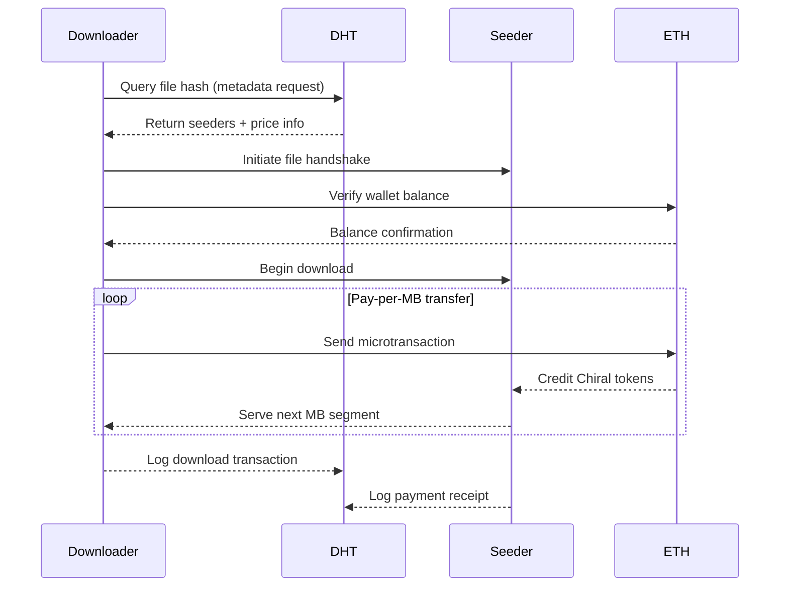
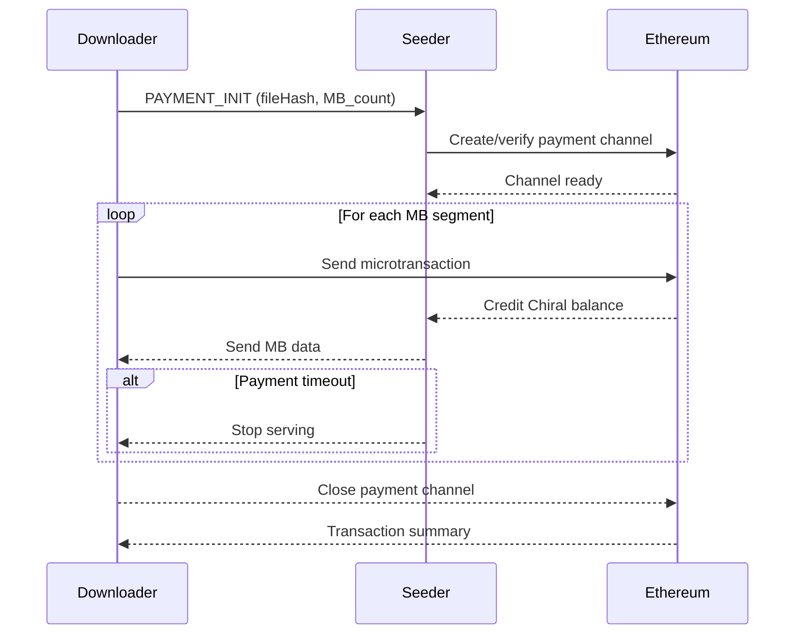
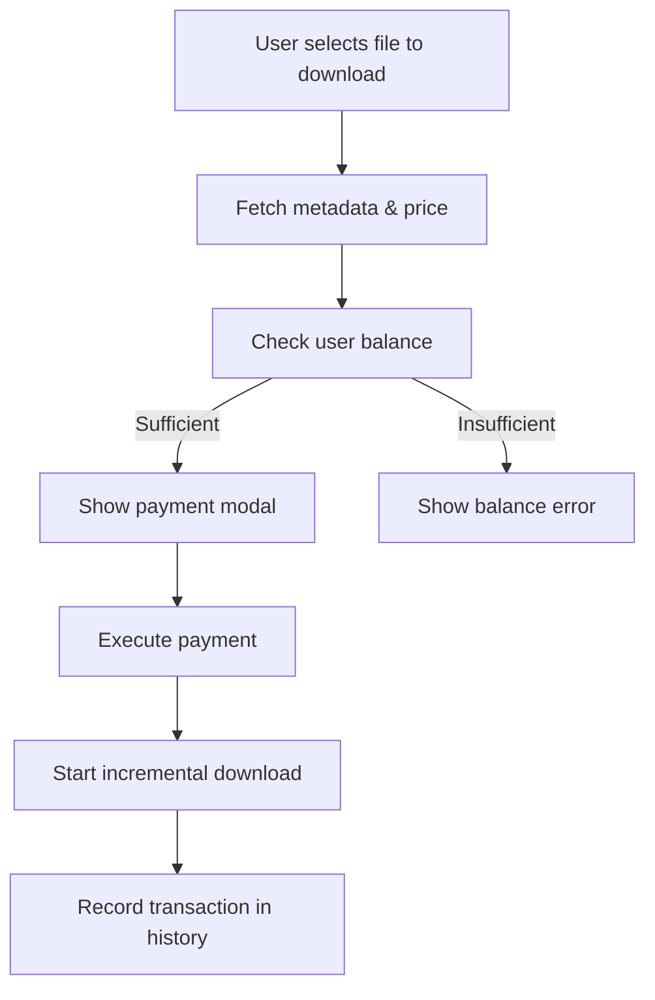

# **File Sharing & Payment System Guide**
Chiral Network implements a BitTorrent-like file sharing model with instant seeding and DHT-based discovery.
## **Purpose**
- Facilitate peer-to-peer file sharing incentivized by **Chiral token** exchange.
- Automatically price files using a **global Chiral-to-MB value** or a **hash-power-based dynamic rate**.
- Provide a consistent protocol for **upload, download, and micropayment flows**.
- Ensure seamless integration between:
  - **Frontend**: pricing display, validation, and payment UX,
  - **Backend**: payment services, wallet handling, and transaction logging,
  - **Network layers**: DHT discovery, seeding, and transport protocols.
- Maintain modular separation between **data transmission** and **payment verification**.

---

## **Overview**
- The Chiral Network implements a **BitTorrent-like file sharing model** with DHT-based peer discovery and instant seeding.
- Each uploaded file has an **associated price**, automatically computed using a **global Chiral-to-MB exchange rate**.
- The default conversion is **1 MB = 0.001 Chiral**.
- No manual price entry is required per upload — prices derive automatically from:
  - The **current global Chiral value**, or
  - A **dynamic rate** calculated from **network hash power**, reflecting mining difficulty.
- Files shared on Chiral Network are:
    - Instantly available when added (no upload process)
    - Identified by cryptographic hashes (SHA-256)
    - Discoverable through the DHT network

### Basic File Sharing

1. **Navigate to Upload Page** (Shared Files)
2. **Add Files** using one of these methods:
   - Click "Add Files" button
   - Drag & drop files onto the card
   - Drag files anywhere on the page
3. **Files are processed immediately**:
   - Content hash generated (SHA-256)
   - Metadata published to DHT
   - File immediately available for download by peers

### File Versioning

Chiral Network supports file versioning:

1. **Upload a file** normally
2. **Upload updated version** with same base name
3. **System tracks versions** automatically
4. **Users can choose** which version to download

## Downloading Files

### Basic Download

1. **Navigate to Download Page**
2. **Enter file hash** received from peer
3. **Click "Search & Download"**
4. **System will**:
   - Query DHT for file metadata
   - Discover seeders
   - Display peer selection modal
5. **Select peers** to download from
6. **Monitor progress** in download queue

### Multi-Source Downloads

Chiral Network supports downloading from multiple peers simultaneously:

- **Parallel chunk downloads** from different peers
- **Intelligent peer selection** based on reputation
- **Bandwidth aggregation** for faster transfers
- **Automatic failover** if peers disconnect
- **Chunk verification** using merkle tree

### Download Queue Management

**Priority Levels**:
- High: Download immediately
- Normal: Queue normally
- Low: Download when bandwidth available

**Queue Controls**:
- Pause/Resume individual downloads
- Cancel downloads
- Reorder queue
- Set concurrent download limit (1-10)

## File Discovery

### Hash-Based Discovery

Files are discovered using their content hash:

1. **Obtain file hash** from peer (out-of-band)
2. **Search using hash** in Download page
3. **DHT returns**:
   - File metadata (name, size, type, price)
   - List of seeders
   - Version information

### Search History

The application maintains search history:
- **Recent searches** saved locally
- **Quick re-download** from history
- **Seeder count** updated in real-time
- **Filter by status** (available, unavailable)

## **System Overview Diagram**



- Price and uploader address fields are automatically populated on upload. The backend references the global pricing configuration to maintain consistent pricing across sessions and peers.

### File Metadata:
```typescript
{
  fileHash: string          // SHA-256 content hash
  fileName: string          // Original filename
  fileSize: number          // Size in bytes
  seeders: string[]         // List of seeder peer IDs
  createdAt: number         // Unix timestamp
  merkleRoot?: string       // Merkle tree root for chunks
  mimeType?: string         // File MIME type
  keyFingerprint?: string   // Key verification
  version?: number          // File version number
  cids?: string[]           // Content IDs for chunks
  price: number             // price of file in Chiral
}
```
## Seeding Behavior

### Continuous Seeding

Files remain seeded as long as they're in your "Shared Files" list:

- **No upload step**: Files immediately available
- **Real-time seeder count**: Shows how many peers have the file
- **Automatic DHT updates**: Metadata refreshed periodically
- **Bandwidth control**: Configurable upload limits

### Seed Management

**Stop Seeding**:
1. Go to Upload page
2. Find file in list
3. Click Remove/Delete
4. File removed from DHT

**Seed Statistics**:
- Total upload bandwidth contributed
- Number of peers served
- Reputation earned from seeding

## Advanced Features

### Chunk-Based Transfers

Large files are split into chunks:

- **Configurable chunk size** (default 256 KB)
- **Bitswap protocol** for efficient exchange
- **Parallel chunk transfer** from multiple sources
- **Integrity verification** per chunk
- **Resume support** for interrupted transfers

### Bandwidth Scheduling

Control when files are seeded:

1. **Navigate to Settings** → Bandwidth Scheduling
2. **Create schedules** with:
   - Time ranges (HH:MM format)
   - Days of week
   - Upload/download limits
3. **Enable scheduling**
4. **System applies limits** automatically

### File Storage

Files are stored locally:

- **Default location**: `~/ChiralNetwork/Storage`
- **Configurable path**: Change in Settings
- **Storage limits**: Set maximum storage size
- **Auto-cleanup**: Remove old files automatically

## Best Practices

### For Uploaders

1. **Verify file hashes** before sharing
2. **Share complete files** (no partial uploads)
3. **Keep seeding** to ensure availability
4. **Monitor bandwidth** usage

### For Downloaders

1. **Verify file hashes** with sender
2. **Check seeder count** before downloading
3. **Select multiple sources** for faster downloads
4. **Scan files** before opening

### Privacy Considerations

1. **Seeding reveals IP**: Use proxy/relay for anonymity
2. **Metadata is public**: DHT metadata visible to all peers
3. **Consider file names**: Avoid revealing information

## Troubleshooting

### File Not Found
- Verify file hash is correct
- Check if seeders are online
- Wait for DHT propagation (~30 seconds)
- Try searching again later

### Slow Downloads
- Select more seeders
- Check your download bandwidth limit
- Verify seeders have good reputation
- Enable multi-source downloads

### Upload Not Working
- Check DHT is connected
- Verify file is not corrupted
- Ensure storage path is writable
- Check firewall settings

# Global Pricing System

Objective: Maintain a single global configuration for determining the Chiral-to-MB conversion, avoiding manual price setting for every file. 

### Mechanisms

1. Static Global Rate (Default)
    - Conversion: 1 MB = 0.001 Chiral.
    - Stored globally in the DHT or config service.
    - Provides stability and simplicity.

2. Dynamic Hash-Power-Based Rate: Adjusts pricing based on the network’s mining difficulty.
```pricePerMB = (baseHashCost / avgHashPower) * normalizationFactor```

##### Dynamic Hash-Power Based Pricing Explanation:

| Variable             | What it means                             | Units (approx.)                |
|----------------------|-------------------------------------------|--------------------------------|
| `network_hashrate`   | Total computational power of network       | Hashes/second                  |
| `active_miners`      | Number of active miners                    | count                          |
| `power_usage`        | Power used by individual miner             | Watts                          |
| `avgHashPower`       | Average hashrate per miner                 | Hashes/second per miner        |
| `baseHashCost`       | Energy consumed per hash                   | Watts / (Hashes/second)        |
| `normalizationFactor`| Tunable scaling factor                     | Dimensionless                  |
| `pricePerMB`         | Final Chiral price per MB                  | Chiral / MB                    |


- In order to calculate the price per MB (using the dynamic hashrate of the network) we use the formula: ` pricePerMB = (baseHashCost / avgHashPower) * network_difficulty * normalizationFactor`
- Average Hash Power = Network Hash Rate / Active Miners:
  - The average hash power per miner is calculated as the total network hashrate divided by the number of miners and this essentially gives a baseline for what an average miner contributes to the network
- Base Hash Cost (Per Miner) = Power Usage / Max(Average Hash Power, 1)
  - This represents the unit cost of computing one hash for the current miner, normalized to the network average. Essentially, how expensive is it for this miner to generate a hash relative to the average network power. A miner with low efficiency (High power usage and low hash output) will have a higher base hash cost.
  - Dividing by Max(Average Hash Power, 1) ensures that we do not divide by 0 even when the network hashrate is low
- Price Per MB = (Base Hash Cost / Average Hash Power) * Network_Difficulty * Normalization Factor`
  - Adjust the miner’s cost by comparing it to the network average hash power and normalize the cost per hash
  - Scale the mining difficulty based on how many hashes are needed to “mine” a block
  - Multiply by the normalization factor (this is tunable) to convert the computational cost into price per MB
  - Essentially gives a sense of how much it costs this miner to process data compared to the network.


# Download Control & Payment Enforcement Protocol
### Mechanism
##### During downloads:
- Node B (seeder) serves file chunks through HTTP/WebRTC.
- The protocol enforces payment checkpoints after specific data amounts are transmitted.

##### Example Control Logic:
- Serve first 10 MB as initial handshake segment.
- If no payment received after 10 MB → stop serving.
- If payment received → continue serving.
- Download resumes with incremental payments:
   - 1 MB --> pay Chiral
   - 2 MB --> pay Chiral
   - 4 MB --> pay Chiral
   - etc

##### Payment Options


| Mode                     | Description                                        | Recommended For                                 |
| ------------------------ | -------------------------------------------------- | ----------------------------------------------- 
| **Exponential Scaling**  | Payments grow as trust builds (1→2→4→8 MB).        | Typical use case, balances risk and efficiency. |
| **Full Upfront Payment** | Pay entire file price at once.                     | Trusted seeders or verified peers.              |

Potential Protocol Message Specification:
| Message Type        | Direction               | Description                                    |
| ------------------- | ----------------------- | ---------------------------------------------- |
| `PRICE_QUERY`       | Downloader → DHT        | Request global Chiral price and file rate      |
| `PRICE_RESPONSE`    | DHT → Downloader        | Return computed price per MB                   |
| `PAYMENT_INIT`      | Downloader → Seeder     | Initiate payment session                       |
| `PAYMENT_ACK`       | Seeder → Downloader     | Confirm receipt of Chiral payment              |
| `CHUNK_REQUEST`     | Downloader → Seeder     | Request data chunk (N MB)                      |
| `CHUNK_DELIVER`     | Seeder → Downloader     | Serve chunk upon payment confirmation          |
| `PAYMENT_FAILURE`   | Seeder → Downloader     | Stop serving due to missing or invalid payment |
| `REPUTATION_UPDATE` | Seeder/Downloader → DHT | Submit peer trust rating                       |


##### Payment Flow Protocol

#### Ethereum/Chiral Integration:
##### Wallet Capabilities:
Each peer node runs a local Ethereum-compatible wallet supporting:
- getBalance()
- sendPayment(address, amount)
- verifyTransaction(txHash)
- logTransaction(metadata)

##### Transaction Model
Transactions include:
- Recipient address (seeder)
- File hash reference
- Payment amount (in Chiral)
- Metadata (timestamp, MB segment)

#### Security
- Transactions are cryptographically signed with user’s private key.
- DHT stores public receipts only, never private keys.
- Local key storage handled securely within native environment (e.g., Tauri).

#### Gas and Fees
- Each transaction includes a small gas fee.
- Estimated cost = base gas + data fee.
- Option to dynamically add a “gas surcharge” to file price for accurate costing.

### Frontend Integration
#### Features
- Automatic price computation after file upload.
- Price badges display file cost in Chiral.
- Balance check prior to download.
- Payment confirmation modals for user validation.
- Transaction logs shown in account dashboard.
- Live peer-to-peer toasts for payment success/failure notifications.

#### Payment UI Flow


### Areas for Improvement & TODOs
- Define rounding rules for price display (e.g., 4 decimal places).
- Add automated tests for global pricing updates.
- Handle empty or zero-byte file uploads gracefully.
- Include uploader/audit logs for all uploads.
- Implement transaction timeouts and retry strategies.
- Add multi-seeder payment splitting support.
- Include gas fee estimation in pricing UI.
- Enable dynamic rate propagation through DHT.
- Build reputation registry for trust-weighted pricing.
- Develop control parameters for HTTP server payment enforcement.


### Summary
##### The Chiral File Sharing & Payment System integrates peer-to-peer file distribution with an adaptive Chiral-based payment mechanism. This system ensures:
- Automated and fair file pricing through global or hash-based valuation.
- Incremental, flexible payment protocols tied to network trust.
- Ethereum-backed settlement for verifiable transactions.
- Scalable architecture for decentralized, incentive-aligned file exchange.

## See Also

- [Network Protocol](network-protocol.md) - P2P transfer details
- [Security & Privacy](security-privacy.md) - Encryption features
- [User Guide](user-guide.md) - Step-by-step instructions
